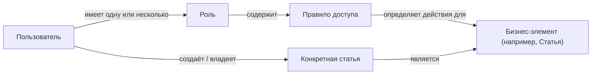

## 1. Структура моделей
### 1.1 Схема

### 1.2 Описание
Пользователь - это имя, емейл, пароль и прочее.
Роль - это название группы пользователей.
Правило - это связь между объектом и ролью, содержащая права, которые у роли есть в объекте.
Объект - это название группы экземпляров.
Экземпляр - минимальная часть группы, конкретный её участник.

Для любого действия из CRUD есть 2 вида разрешений: *_all_permission и *_permission. Первый тип открывает доступ к выполнению действия над всеми экземплярами в этой группе. Второй - только над своими. 
## 2. Запуск
## 2.1. Клонировать репозиторий
### Клонирование репозитория
```bash
git clone https://github.com/Kirabrin2v/custom_auth
cd custom_auth
```

## 2.2 Подготовить окружение
### Создать репозиторий и установить зависимости
```bash
python3 -m venv venv
source venv/bin/activate
pip install -r requirements.txt
```

## 2.3 Создать тестовые данные
### Заполнение БД тестовыми данными
```bash
python3 create_test_data.py
```

## 2.4 Запустить сервер
### Запуск сервера
```bash
python3 manage.py runserver
```
